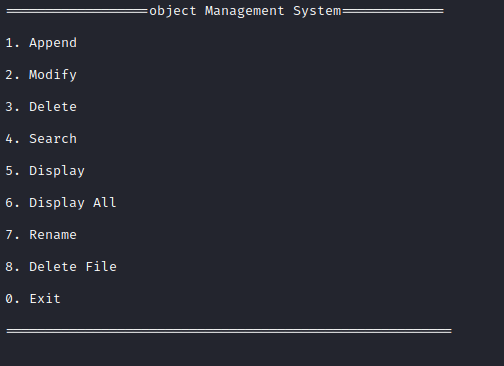

# Image Processing
**[Note] :At the beginning I've planned to explain the path that I have followed, the methods and algorithms that is used inside this project. We start by explaining the methods, algorithms and functionality of this project. Lastly I have put some demonstration of how to run this project and use it :) .**

---

#### what is image processing?
image processing is **a method to perform some operations on an image**, in order to get an enhanced image or to extract some useful information from it. In this project our target is BMP images.

## Operations that we have used :
### 1. Reading and writing : 
Of course the first operations that we have are, read and write BMP images.
while we reading BMP images, according to header structure we do extract some information that are useful for example : file signature (to make sure that image is BMP), size of image, image width and height, size of pixel data and more.

---

### 2. Convert To Gray :
Converting and BMP image to gray is done by looping through every pixel, calculating mean of red, green and blue values and then set that calculated value as all three red, green and blue. We do calculate padding too. example output : 

---

### 3. Convert to binary :
Binary images are **images whose pixels have only two possible intensity values**. Numerically, the two values are often 0 for black, and either 1 or 255 for white. For converting BMP image to binary we first calculate histogram of image ( the histogram of an image refers to a histogram of the pixel intensity values). Then I have used K-means Clustering method to find means and using calculated mean to assign pixels 0 or 1 values. example output : 

---

### 4. Morphology Operations :
The primary morphology operators are **erosion, dilation, opening, and closing**. We use these operators to solve some unstable or unorder  part of image. After converting an image to Binary you might see some holes or noise inside that image that you do not want or maybe some part of objects seem that they are connected to each other. I have used dilation operator to cover the holes inside the image and erosion operator to disconnected some connected part. You can manually call these function as long as you want but to speed up this process you can use opening, closing and boundary-extraction methods. (Opening is erosion followed by dilation. Closing is vice versa). example output : 

| Binary image | Opening | dilation at last to close the holes |
| --- | --- | ---|
||||

---

### 5. Labeling :
I label objects inside the binary image by assigning unique color values to its pixels. We loop over image data and label each pixel by assigning a unique color to pixels that are connected. We label image according to '4-neighborhood region identification' method. ( The neighborhood of a pixel is the collection of pixels which surround it and The 4-neighbors of pixel p, are the four pixels located at, respectively, above (north), below (south), to the left (west) and right (east) of the pixel p). example output :

| Binary image | Labeled | 
| --- | --- |
|||

### 6. Bounding_Box :
After labeling image and object inside it we can draw bounding box around detected objects inside image. In labeling process we assign an unique color values to every detected object we use this information to differentiate between objects. By using linked lists we can add every detected object and put them in a list and after that we can find position of every object and draw bounding box for that object. example output : 

| Labeled image | Bounding_Box | 
| --- | --- |
|||

---

### 7.  Feature Extraction :
The main goal here is to calculate invariant moments for objects inside image, Invariant moments are **features of an image that are unchanged under translation, rotation, or scaling of the image**, and are very useful in pattern-recognition problems. We want  to calculated invariant moments to make a program that is able to determine an object type inside images. We calculate moment values for every object detected and after all calculation prompt users to ask if they want to save these values inside our database. (I have code a basic database that is text mode database,  we write to it in binary mode. We have some basic function that help us to add, remove, modify, rename, find id,
and some other operations ). example output:

---

### 8. Check Matching :
What it does is basically check and detect objects inside an image and if it can find object inside database it returns the names of the detected objects. It takes an original image and perform all the operations that we saw till this point automatically, calculate invariant moments and check database for equal invariant moments and if it find it returns the name of that object.

---

### 9. Canny Edge Detection :
Edge detection is a technique of image processing used to identify points in a digital image with discontinuities, simply to say, sharp changes in the image brightness. These points where the image brightness varies sharply are called the edges (or boundaries) of the image.

Canny edge detection is a technique to extract useful structural information from different vision objects and dramatically reduce the amount of data to be processed. It has been widely applied in various computer vision systems.

I break down canny edge detection into some steps to explain it better. These steps are :
1. applying Gussian filter that will blur the image and makes the parts that
intensity changes inside the image pups out and be more realizable. That
helps us to detected edges easier and also it reduces the noise inside the image.
To do this we need to calculate the gussian coefficients. the size of gussian filter
can change depending on sigma value, I choosed size 3x3.

| Gray image | Gussian Blue [3x3] | 
| --- | --- |
|||
note : As you can see the edges are more realizable and more clear in blur image.

2. Compute gradient magnitude and direction at each pixel of the smoothed image. For doing this we derivative the image once from X-axis and once from Y-axis. This is done by using the two 3x3 arrays Gx_derivative and Gy_derivative, you can see these arrays inside 'egde_detection.c' source code. these two array apply as mask  to hole image data.  example output :

| Gx derivative | Gy derivative | 
| --- | --- |
|||

3. After derivative image accoding to Y and X axis we use this value to calculate Gradiant image. We basically loop true all image and get Y and X value derivative at that at that position. position and use the formula square_root(X*X + Y*Y) to get the Gradinat. example output: 

4. Now we thining the wide lines make them lines that are one pixel wide. The idea here is to Compare the edge strength of the current pixel with the edge strength of the pixel in the positive and negative gradient directions. If the edge strength of the current pixel is the larger compared to the other pixels in the mask with the same direction (e.g., a pixel that is pointing in the y-direction will be compared to the pixel above and below it in the vertical axis), the value will be preserved, Otherwise, the value will be suppressed. Directions are calculated by getting inverse tangent of derivative Y to derivative X ( arcTan(Gy/Gx) ) . We call this non-maxima
	suppression). example output : 
	
5. Last but not least we threshold the image or in other words find edges that are connected together and assign foreground value(white 255) to them. For doing this we loop over the image and look if the pixels are bigger that the
	Tmax(a fixed value that is given by use as parameter) and any time we find a pixel that has the greater value than Tmax we assign foreground to it and add it to edges array. any entery inside the array is detected as an edge so what we do we look to every neighbours of edges and check if any neighbour is bigger than the Tmin(also fixed value that is given by use as parameter) and if we find any neighbour bigger than the Tmin we add that pixel to edges array and repeat the same operation for every entry inside the edges array until this array became empty.
	example output : 
	
	
---
---
# How To Use and Run Program :
Our program is a command line program so for executing this you need to run it from command line. So open your command line and go to the same directory as project and all you need is to type 'make' in command line. This command rebuild the make file and inside make file you simply say what you want to execute. 

After typing 'make' inside command line you see a new executable file called 'run' in the same directory that make file is. all you need is to run this executable file. (./run)

You can give the path of BMP image that you want to do operation on, inside command line while executing 'run' as parameter or when you run the program it will as user to enter a path. ex:

| give image path after running the program | give path as parameter | 
| --- | --- |
|||

After specifying the image path, program open the BMP image and shows some information about that image along with a menu that give you range of options that you can perform on the BMP image. exp:

### For converting to Gray enter 1.
[Note :] For seeing the results you need to save the image to a path. So after Entering 1 then you need enter 10 to save it to a path.

| Original Image | Gray Image | 
| --- | --- |
|||

### For converting Gray to Binary enter 2.
You will prompt to select between two options ( 1 or 2 ) . I made this prompt because when we binary an image sometimes 255 get assigned to  background pixels and 0 to foreground pixels , So if this happened to you too just select the other option and it will be alright.

| Original Image | Gray Image | 
| --- | --- |
|||

### For performing morphology operations enter 3, 4 and 5.
Entering 3 will perform opening and closing operator, but if you want to perform dilation and erosion manually you can enter 4 for dilation and 5 for erosion.

### For Labeling enter 6 .

| Binary Image | Labeled Image | 
| --- | --- |
|||

To be honest this labeling example is not valid because there is not bunch of objects to detect. We use labeling when we have some objects inside our BMP image for example if you have and image that contains bunch of coins and other shape.

### For drawing Bounding-box enter 7.

| Labeled Image | Bounding-box Image | 
| --- | --- |
|||

again not a useful example.

### For Edge Detection enter 13

| Gray Image | Edge_Detected Image | 
| --- | --- |
|||

### For reset all the changes enter 11

### For connecting to database enter 12
After entering 12 you connect to database and you get a prompt like :

| Database menu | Display all | 
| --- | --- |
|||

Here you can append, modify, delete, search, display, rename the entries. You also can delete the whole database file by entering 8 (delete file) after connecting to database.
